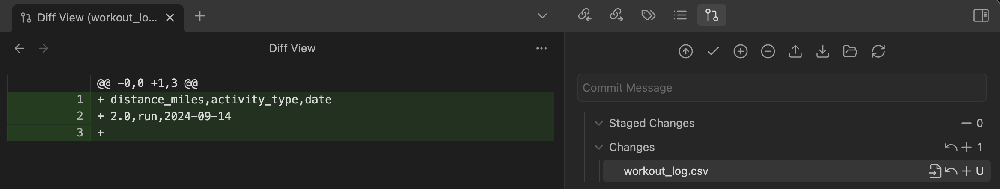

# Capture
An aid for plain text note management. Intended for use with tools like [Obsidian](https://obsidian.md/).

**Quick-capture cli**
```
python -m scripts.capture
add to vault: start a new csv workout log and add that I went on a 2 mile run today
```


**Integrate transcribed audio**
```
python -m scripts.listen
```

## Setup
### Dependencies
Audio transcription requires ffmpeg:
```
brew install ffmpeg
```

Install python packages with [pipenv](https://pipenv.pypa.io/en/latest/):
```
pip install pipenv
pipenv shell
pipenv install
```

### Environment
This tool requires an [OpenAI API key](https://platform.openai.com/api-keys).

Create an `.env` file as follows:
```
AUDIO_DIRECTORY=~/Library/Application Support/com.apple.voicememos/Recordings
OPENAI_API_KEY=your-api-key
VAULT_DIRECTORY=your-vault-path
```


## Recommendations
### Version control
This tool will write content directly to your files, so adding version control to your notes directory is strongly advised. Obsidian users can reference [obsidian-git](https://github.com/Vinzent03/obsidian-git).

### Manually editing notes
Continue to manually edit your notes as you otherwise would! Capture doesn't keep state, so it won't be thrown off if you interleave it's automated additions with manual ones.
